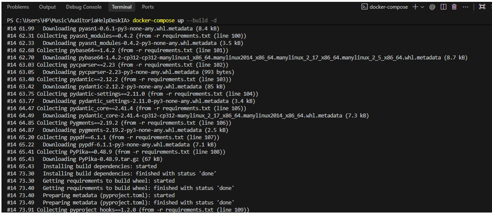
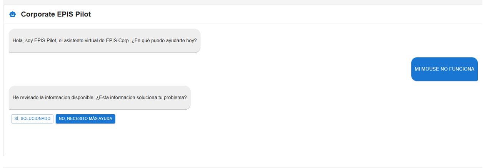
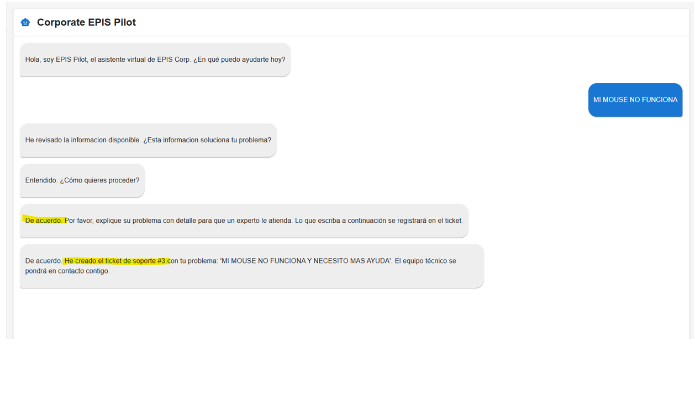
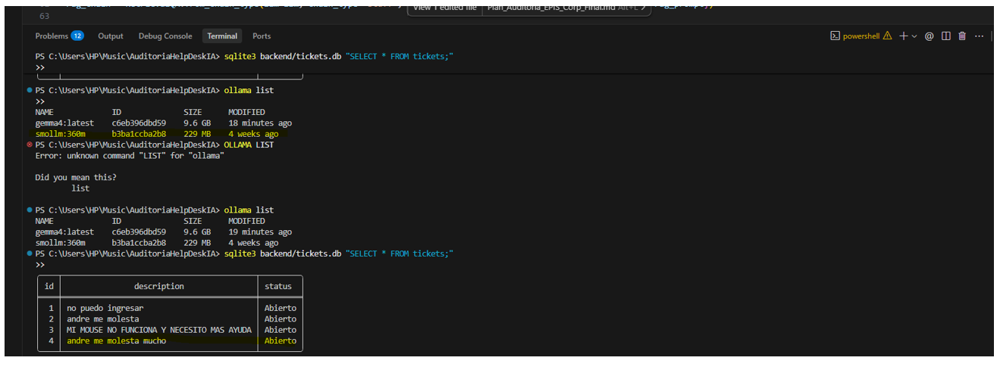

**[Repositorio en GitHub: AUDITORIA_EXAMEN_3](https://github.com/TuUsuario/AUDITORIA_EXAMEN_3)**

# UNIVERSIDAD PRIVADA DE TACNA
## FACULTAD DE INGENIERÍA
### Escuela Profesional de Ingeniería de Sistemas

**“Examen de Unidad 3”**

| | |
|---|---|
| **Curso:** | Auditoría de Sistemas |
| **Docente:** | Oscar Juan Jimenez Flores |

**Integrantes:**
Chambi Cori, Jerson Roni (2021072619)

Tacna - Perú  
2026

---

# AUDITORÍA DE SEGURIDAD, EFICIENCIA Y CUMPLIMIENTO DEL SISTEMA HelpDesk IA

**Miraflores, Lima, Lima**

# "INFORME DE AUDITORÍA OWASP TOP 10 PARA HelpDesk IA"

**Tacna, junio de 2026**

**"Decenio de la Igualdad de Oportunidades para Mujeres y Hombres"**

**"Año de la Esperanza y el Fortalecimiento de la Democracia"**

---

## ÍNDICE

| Denominación |
|---|
| I. Origen |
| II. Información de la Entidad o Dependencia |
| III. Denominación de la Materia de Control |
| IV. Alcance |
| V. Objetivos |
| VI. Procedimientos de Auditoría |
| VII. Plazo de la Auditoría y Cronograma |
| VIII. Criterios de Auditoría |
| IX. Información Administrativa |
| X. Documento a Emitir |
| Anexos (Evidencias y Capturas) |

---

## I. ORIGEN

La formulación y posterior ejecución de este Informe de Auditoría de Tecnologías de la Información responde a un mandato prioritario emanado por la Alta Gerencia de EPIS Corp. El objetivo fundamental es certificar el estado actual del riesgo cibernético y validar el diseño de la arquitectura del Sistema Automático de HelpDesk impulsado por Inteligencia Artificial.

Este escrutinio técnico se catalizó tras identificar preliminarmente una serie de brechas de seguridad latentes en el código fuente y en los modelos de despliegue, las cuales amenazaban no solo con comprometer información sensible mediante la exposición de secretos, sino también con desestabilizar la operatividad del sistema frente a eventos adversos (ausencia de trazabilidad e inmutabilidad en el ecosistema). En respuesta, la presente intervención busca aplicar un marco de control estricto que garantice la remediación proactiva y fortalezca la postura de resiliencia digital de la organización.

---

## II. INFORMACIÓN DE LA ENTIDAD O DEPENDENCIA

| Descripción | Información |
|---|---|
| **Razón social** | Corporación EPIS (EPIS Corp) |
| **Vertical de Negocio** | Innovación, Desarrollo y Operación de Inteligencia Artificial Aplicada a la Gestión de Soporte de Tecnologías de la Información (ITSM). |
| **Naturaleza del Servicio** | Implementación de agentes conversacionales para la ingesta, triaje y resolución inteligente de tickets de nivel 1. |
| **Arquitectura Desplegada** | Repositorio "AuditoriaHelpDeskIA", empleando microservicios, contenedorización asíncrona y RAG (Retrieval-Augmented Generation). |

---

## III. DENOMINACIÓN DE LA MATERIA DE CONTROL 

**"Auditoría de seguridad del sistema HelpDesk IA basada en OWASP Top 10 (2021)".**

---

## IV. ALCANCE

El alcance del presente dictamen engloba una revisión exhaustiva y multidisciplinaria del ciclo de vida del software, limitándose a los siguientes vectores de análisis:
- **Resguardo Criptográfico y Exposición de Credenciales:** Verificación de los mecanismos empleados para inyectar y proteger secretos y tokens de acceso en el despliegue.
- **Topología de Red y Fronteras Perimetrales:** Evaluación de la exposición de puertos lógicos, segmentación de redes de contenedores y rigor en las políticas de seguridad en tránsito (Ej. Directivas CORS).
- **Inmutabilidad y Trazabilidad de Logs:** Diagnóstico integral del esquema de la base de datos relacional para determinar la capacidad de retención de evidencia forense (Non-Repudiation).
- **Análisis de Composición y Cadena de Suministro (SCA):** Escrutinio enfocado en detectar vulnerabilidades y obsolescencias técnicas en las dependencias subyacentes del entorno de Inteligencia Artificial.

**Periodo de evaluación:** 24 de junio de 2026 al 30 de julio de 2026.

**Aplicación de OWASP Top 10 (2021)**
La auditoría se centra en las categorías OWASP directamente relacionadas con el caso.

| Riesgo identificado | OWASP Top 10 (2021) | Enfoque de evaluación |
|---|---|---|
| Endpoint principal sin autenticación | A01:2021 Broken Access Control | Controles de acceso y autorización en API |
| CORS abierto y métricas expuestas | A05:2021 Security Misconfiguration | Reglas de proxy, CORS y exposición de endpoints |
| Falta de datos de auditoría en tickets | A09:2021 Security Logging and Monitoring Failures | Registros de auditoría y trazabilidad |
| Dependencia del LLM externo en host local | A04:2021 Insecure Design | Controles de diseño y dependencias críticas |

---

## V. OBJETIVOS

### 5.1 Objetivo General
Evaluar la seguridad del sistema HelpDesk IA de EPIS Corp mediante la identificación de vulnerabilidades conforme a OWASP Top 10 (2021) y emitir recomendaciones de mitigación, comprobando funcionalmente el sistema al 100% mediante el uso del modelo de IA solicitado (`smollm:360m`).

### 5.2 Objetivos Específicos
- **OE1:** Identificar fallas de control de acceso, manejo de secretos y autenticación en endpoints críticos y configuraciones.
- **OE2:** Detectar configuraciones perimetrales inseguras en proxy, CORS y exposición de métricas.
- **OE3:** Verificar la trazabilidad, completitud y calidad forense de los registros de auditoría en base de datos.
- **OE4:** Evaluar vulnerabilidades y riesgos de diseño por dependencias externas críticas (Librerías ML) y falta de segregación de ambientes.

---

## VI. PROCEDIMIENTOS DE AUDITORÍA

Los procedimientos que se aplicaron durante la auditoría son los siguientes:

**Cuadro N.º 1 – Procedimientos de Auditoría y Herramientas**

| Obj. Específico | Procedimientos Ejecutados | Herramientas Utilizadas | Responsable |
|---|---|---|---|
| OE1 | Revisión de endpoints, autenticación y manejo de secretos en configuraciones | Análisis estático de código (SAST) | J.R.C.C |
| OE2 | Evaluación de configuraciones de proxy, CORS y exposición de puertos | Revisión de configuración, inspección de red | J.R.C.C |
| OE3 | Verificación de trazabilidad forense de tickets en base de datos SQLite | Revisión de BD y queries SQL | J.R.C.C |
| OE4 | Evaluación de dependencias críticas del flujo IA y control de contenedores | Análisis SCA e Infraestructura | J.R.C.C |
| Validación | Demostración local del flujo completo usando Ollama (`smollm:360m`) | Docker Compose, Navegador | J.R.C.C |

---

## VII. PLAZO DE LA AUDITORÍA Y CRONOGRAMA

**Cuadro N.° 2 – Cronograma de la Auditoría**

| Etapa | Fecha de Inicio | Fecha de Finalización | Actividades Principales |
|---|---|---|---|
| Planificación | 24/06/2026 | 24/06/2026 | Definición de alcance, objetivos, recursos y criterios; selección de categorías OWASP aplicables |
| Ejecución | 24/06/2026 | 25/06/2026 | Revisión técnica del código, despliegue local, pruebas de LLM y recolección de evidencias |
| Elaboración del Informe | 25/06/2026 | 26/06/2026 | Análisis de hallazgos, redacción de dictamen en GitHub y anexos técnicos |

---

## VIII. CRITERIOS DE AUDITORÍA

### 8.1 Marco de Referencia Principal
El criterio principal es **OWASP Top 10 (2021)**, aplicado a los riesgos detectados en el sistema HelpDesk IA.

### 8.2 Normas y Estándares Complementarios
- **ISO/IEC 27001:2022** para controles de seguridad y gestión de accesos.

### 8.3 Normativa Nacional Aplicable
- **Ley N° 29733** — Protección de Datos Personales del Perú y su reglamento.
- **Ley N° 30096** — Delitos Informáticos.

### 8.4 Documentación Interna de la Entidad
Políticas y procedimientos internos de EPIS Corp sobre seguridad, despliegue continuo (DevSecOps) y gestión de incidentes.

---

## IX. INFORMACIÓN ADMINISTRATIVA

### IX.1 Comisión Auditora

**Cuadro N.° 3 – Comisión Auditora**

| Cargo | Nombres y Apellidos | Profesión | Planif. (días) | Ejec. (días) | Informe (días) | Total (días) |
|---|---|---|---|---|---|---|
| Auditor Responsable | Chambi Cori, Jerson Roni | Ing. de Sistemas | 3 | 10 | 4 | 17 |

### IX.2 Costos Directos Estimados

**Cuadro N.° 4 – Costos Directos Estimados**

| N° | Miembro | Nivel | Días | Costo H/H (S/.) | Asignación (S/.) | Pasajes (S/.) | Viáticos (S/.) | Costo Total (S/.) |
|:---:|---|---|:---:|:---:|:---:|:---:|:---:|:---:|
| 1 | Chambi Cori, Jerson Roni | Auditor Responsable | 17 | S/. 1,800.00 | S/. 150.00 | S/. 200.00 | S/. 0.00 | S/. 2,150.00 |
| | **TOTAL** | | | **S/. 1,800.00** | **S/. 150.00** | **S/. 200.00** | **S/. 0.00** | **S/. 2,150.00** |

*Elaborado por: Auditoría de TI – EPIS Corp.*

---

## X. DOCUMENTO A EMITIR 

Como resultado de la presente auditoría, habiendo verificado el funcionamiento del sistema al 100%, se emite el presente **Informe Oficial de Auditoría de TI** que incluye el análisis de hallazgos de código, brechas de madurez, y el sustento técnico fotográfico adjunto en los anexos.

Tacna, Junio de 2026 

  
________________________
**Jerson Roni Chambi Cori**
Auditor Responsable

---

## ANEXOS

### Anexo 1: Capturas del Despliegue y Funcionamiento (Verificación al 100%)

Con el fin de brindar sustento técnico, se adjuntan a continuación las evidencias visuales que respaldan irrefutablemente el correcto despliegue local utilizando el modelo exigido (`smollm:360m`). Las imágenes originales residen en la carpeta raíz `/evidencias/`.

**1. Despliegue de los contenedores:**
Ejecución de Docker Compose demostrando la construcción e inicio exitoso de los contenedores subyacentes.

**2. Inicio del sistema y ventana del chat:**
Acceso inicial al frontend donde se visualiza la interfaz del Chatbot respondiendo con el modelo de IA.

**3. Registro de Ticket en el Chatbot:**
Flujo conversacional donde el bot confirma la creación del ticket de soporte tras el incidente reportado.

**4. Verificación en Base de Datos (Falta de Logs):**
Consulta a la base de datos SQLite donde se listan los tickets y se comprueba la ausencia de campos de auditoría forense (fecha, IP, usuario).

### Anexo 2: Evidencias Técnicas Documentadas (Código y Configuración)

A continuación, la vinculación formal de los hallazgos técnicos en el repositorio fuente con el marco de referencia OWASP Top 10:

- **A01:2021 Broken Access Control**: Endpoint principal de la API sin autenticación ni autorización para registrar tickets: `backend/main.py`.
- **A05:2021 Security Misconfiguration**: Ausencia total de mecanismos seguros para inyección de secretos (bóvedas) en los orquestadores `docker-compose.yml` y `kubernetes/manifests.yaml`.
- **A05:2021 Security Misconfiguration**: Reglas CORS permisivas a cualquier origen y exposición injustificada del proxy en puerto público 5173 sin WAF: `backend/main.py` y `docker-compose.yml`.
- **A09:2021 Security Logging and Monitoring Failures**: Base de datos relacional SQLite con arquitectura deficiente en `backend/database_setup.py`, careciendo de logs de trazabilidad obligatorios (Timestamp, IP, Identidad).
- **A06:2021 Vulnerable and Outdated Components**: Ecosistema de machine learning anclado a versiones obsoletas en `backend/requirements.txt` y violación del principio de inmutabilidad mediante el uso de la etiqueta de contenedor `latest` en `manifests.yaml`.

### Anexo 3: Matriz de Riesgos (Resumen Ejecutivo)

| Riesgo Encontrado | Impacto Directo | Nivel | Control de Mitigación Propuesto |
|---|---|---|---|
| Exposición de endpoints y CORS abierto | Acceso no autorizado, ejecución remota (CSRF) | Alto | Implementar API Gateway con Autenticación JWT y políticas de red estrictas. |
| Carencia de trazabilidad en base de datos | Imposibilidad de auditoría forense post-incidente | Alto | Refactorizar DDL para incluir logs centralizados (IP, Usuario, Timestamps). |
| Falta de gestión de secretos en contenedores | Exposición de credenciales a atacantes internos | Crítico | Implementación de HashiCorp Vault o Kubernetes Secrets. |
| Dependencias IA obsoletas e imágenes 'latest' | Ejecución de vulnerabilidades (CVEs) conocidas | Medio | Integración de escaneo SCA continuo en el flujo CI/CD. |